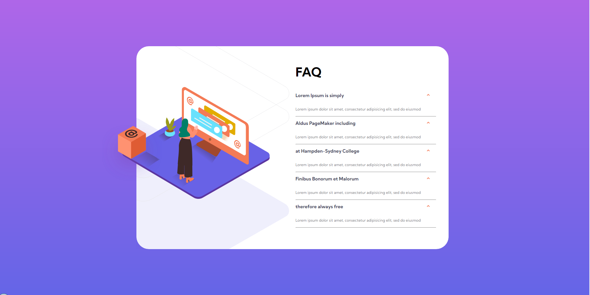

<h1 align="center"> FAQ </h1>

    

Criação da template FAQ accordion card baseado no desafio proposto pela Frontend Mentor que sugeriu desafios reais do mercado de trabalho afim de ajudar no desenvolvimento de novas habilidades de programação.

## Descrição

 O site foi baseado no desafio de programação da Frontend Mentor no qual sugeria o desenvolvimento de uma página de FAQ responsiva a partir de um esboço de como ficaria o site, que poder ser encontrado na pasta __doc__/__design__  nesse mesmo repositório. 

### Desafio proposto

os usuários devem ser capazes de:

* Visualize o layout ideal para o site, dependendo do tamanho da tela do dispositivo
* Veja estados de foco para todos os elementos interativos na página
* Ocultar / mostrar a resposta a uma pergunta quando ela for clicada

## Desdobramento, desenvolvimento

O site foi construido utilizando html, css, sass, javascript e técnicas de responsividade, as dificuldade encontrada foi a utilização do flexbox, para fazer o alinhamento vertical dos elementos mas o problema foi resolvido com exito. 

## Construído com

* [HTML](https://www.w3schools.com/html/) - HTML abreviação para a expressão inglesa HyperText Markup Language, que significa: "Linguagem de Marcação de Hipertexto" é uma linguagem de marcação utilizada na construção de páginas na Web. Documentos HTML podem ser interpretados por navegadores. A tecnologia é fruto da junção entre os padrões HyTime e SGML.

* [CSS](https://www.w3schools.com/css/default.asp) - Cascading Style Sheets é um mecanismo para adicionar estilo a um documento web. O código CSS pode ser aplicado diretamente nas tags ou ficar contido dentro das tags "style". Também é possível, em vez de colocar a formatação dentro do documento, criar um link para um arquivo CSS que contém os estilos.

* [SASS](https://sass-lang.com/) - Sass é uma linguagem de folhas de estilo concebida inicialmente por Hampton Catlin e desenvolvida por Natalie Weizenbaum. Depois de suas versões iniciais, Weizenbaum e Chris Eppstein continuaram a estender Sass com SassScript, uma simples linguagem de script usada em arquivos Sass.

* [JAVASCRIPT](https://www.w3schools.com/js/default.asp) - JavaScript é uma linguagem de programação interpretada estruturada, de script em alto nível com tipagem dinâmica fraca e multiparadigma. Juntamente com HTML e CSS, o JavaScript é uma das três principais tecnologias da World Wide Web.

## Autor

* **Cesar dos Santos de Almeida** - *responsável pela construção e desenvolvimento da template do site*

## Licença
Este projeto está licenciado sob a licença MIT - consulte o arquivo  [LICENSE.md](LICENSE.md) para obter detalhes

## Agradecimentos

* [Frontend Mentor](https://www.frontendmentor.io/) - Responsável por disponibilizar o desafio e os materiais como ilustrações e imagens para a criação do site

## Links
* [FAQ accordion card](https://www.frontendmentor.io/challenges/faq-accordion-card-XlyjD0Oam) - link do desafio do Frontend Mentor.
* [Frontend Mentor](https://www.frontendmentor.io/) - link do site ofical do Frontend Mentor.

